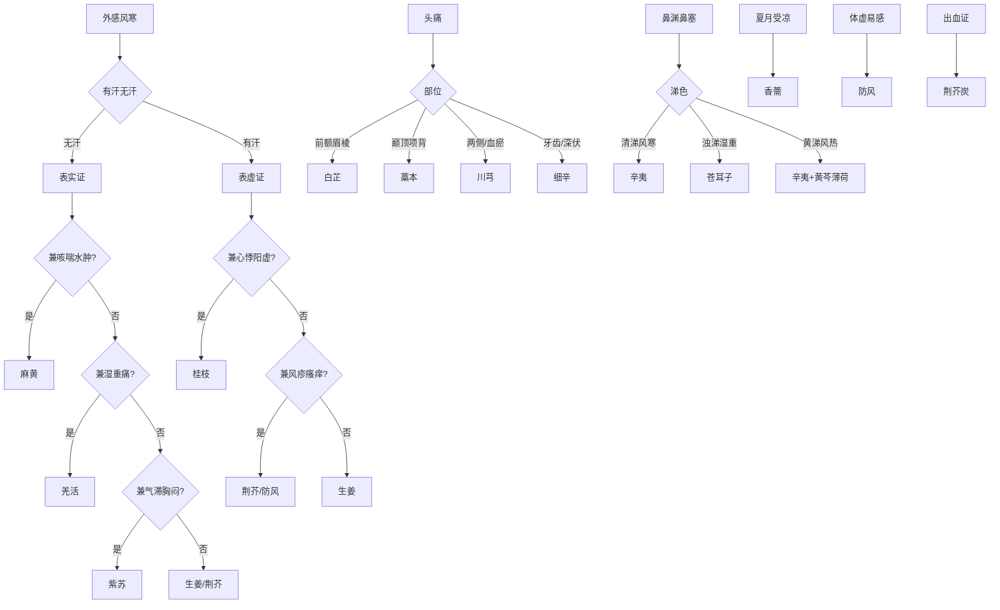

我来设计一套记忆体系，将十三味辛温解表药按**核心逻辑链**串联，而非孤立背诵。记忆的关键是找到每味药的**唯一标识**，即它与其他药最本质的差异点。

---

## 一、记忆总纲：三层定位法

每味药记三个维度：**病位层**（作用在哪里）、**病邪层**（对付什么邪）、**体质层**（什么人能用/不能用）。这三层形成一条逻辑链，临床时按链索骥即可。

---

## 二、病位层记忆：人体表里经络图

将人体从外到内分为五层，每味药锁定一层，不越界：

| 层次 | 对应经络 | 核心药 | 记忆锚点 |
| ---- | ---- | ---- | ---- |
| 皮毛水液 | 肺、膀胱 | 麻黄 | 开毛孔、治水 |
| 营血经脉 | 心、膀胱 | 桂枝 | 调营卫、通血脉 |
| 气机中焦 | 肺、脾 | 紫苏 | 行气、安胎 |
| 经络骨骼 | 膀胱、肾 | 羌活 | 上半身痛 |
| 脾胃中焦 | 肺、脾、胃 | 生姜 | 止呕、解毒 |
| 暑湿中焦 | 肺、脾、胃 | 香薷 | 夏月专用 |
| 风分肌表 | 肺、肝 | 荆芥 | 疹毒、炭止血 |
| 周身风分 | 膀胱、肝、脾 | 防风 | 润剂、不燥 |
| 头面阳明 | 肺、胃、大肠 | 白芷 | 阳明经、疮带 |
| 少阴深伏 | 心、肺、肾 | 细辛 | 透骨、麻舌 |
| 鼻窍湿浊 | 肺 | 苍耳子 | 有刺、有毒 |
| 巅顶项背 | 膀胱 | 藁本 | 巅顶痛 |
| 鼻窍宣通 | 肺、胃 | 辛夷 | 毛笔头、包煎 |

**记忆口诀**（按层次顺序）：

> 麻黄开水桂调营，紫苏行气姜止呕，香薷夏月荆芥疹，防风润剂白芷面，细辛透骨耳子刺，藁本巅顶辛夷笔。

---

## 三、病邪层记忆：风寒湿邪的六种组合

外感病邪无非风寒湿邪，每味药对应一种组合，找到专属组合即锁定药物：

| 病邪组合 | 代表药 | 典型场景 |
| ---- | ---- | ---- |
| 寒+水（表实无汗+水肿） | 麻黄 | 冬天淋雨，恶寒无汗，脸肿 |
| 风+寒+虚（有汗+怕风） | 桂枝 | 吹风后汗出、恶风、心悸 |
| 风+寒+气滞（胸闷+恶心） | 紫苏 | 受凉后胸闷、妊娠呕吐 |
| 风+寒+湿+痛（肩背痛） | 羌活 | 久坐空调房，肩背僵硬痛 |
| 风+寒+胃寒（呕吐+腹泻） | 生姜 | 吃冷饮后胃痛、呕吐 |
| 暑+湿+寒（夏月受凉） | 香薷 | 夏天吹空调，恶寒发热、腹痛 |
| 风+疹毒（麻疹不透） | 荆芥 | 小孩出疹子，疹发不畅 |
| 风+湿+虚（体虚反复感冒） | 防风 | 老人易感风邪、自汗 |
| 风+寒+头面（前额痛+鼻塞） | 白芷 | 头痛连眉棱骨、鼻塞流浊涕 |
| 风+寒+深伏（牙痛+巅顶痛） | 细辛 | 牙痛彻骨、头痛如锥 |
| 风+湿+鼻窍（鼻塞+浊涕） | 苍耳子 | 鼻渊多年，浊涕不止 |
| 风+寒+巅顶（头顶痛+项强） | 藁本 | 头痛连项背，巅顶如裂 |
| 风+寒+鼻窍（鼻塞+呼吸不畅） | 辛夷 | 鼻塞不通，嗅觉失灵 |

**记忆逻辑**：先辨病邪组合，再定层次，两维交叉即得药物。例如"夏天受凉+腹痛"→暑湿寒+中焦→香薷；"头痛连眉棱骨+鼻塞"→风寒+头面阳明→白芷。

---

## 四、体质层记忆：禁忌即定位

副作用不是负担，而是反向定位工具。记住每味药的**绝对禁忌**，即可反推适用体质：

| 药物 | 绝对禁忌 | 反向定位 |
| ---- | ---- | ---- |
| 麻黄 | 高血压、失眠、表虚自汗 | 体实、无汗、血压正常 |
| 桂枝 | 孕妇、阴虚火旺、血热出血 | 表虚有汗、营卫不和 |
| 紫苏 | 气虚多汗（相对）、孕妇慎用 | 气滞胸闷、妊娠恶阻 |
| 羌活 | 血虚痹痛、阴虚火旺 | 体实、湿重、上半身痛 |
| 生姜 | 阴虚火旺（相对） | 胃寒呕吐、日常食疗 |
| 香薷 | 表虚多汗（相对） | 夏月体实、外寒内湿 |
| 荆芥 | 无绝对禁忌，生熟异治 | 各类风邪、出血证 |
| 防风 | 无绝对禁忌，风药润剂 | 体虚外感、全身风湿 |
| 白芷 | 阴虚火旺、痈疽已溃 | 头面实证、疮疡初起 |
| 细辛 | 肾功能不全、孕妇、剂量不过3克 | 深伏寒邪、窍道不通 |
| 苍耳子 | 肝肾功能不全、生品禁用 | 鼻渊湿浊、需炒黄 |
| 藁本 | 阴虚火旺、血虚头痛 | 巅顶实痛、项背强痛 |
| 辛夷 | 无明显禁忌，需包煎 | 各类鼻渊、鼻塞不通 |

**记忆口诀**（按毒性分级）：

> 无毒平和姜防荆，辛夷紫苏香薷平；小毒麻黄白芷耳，有毒细辛不过钱；苍耳炒黄耳子散，藁本巅顶辛夷包。

---

## 五、对比记忆：四组易混药对

临床最易混淆的药对，用一句话区分：

**麻黄 vs 香薷**：麻黄冬月峻汗治水，香薷夏月缓汗化湿。一冬一夏，一峻一缓，一表水一暑湿。

**桂枝 vs 紫苏**：桂枝解肌调营卫（有汗），紫苏行气宽中焦（胸闷）。一血一气，一表虚一气滞。

**羌活 vs 防风**：羌活治上肩背痛（燥烈），防风周身风湿痹（润剂）。一上一下，一燥一润，一实一虚。

**白芷 vs 细辛 vs 藁本 vs 辛夷**：白芷前额阳明痛，细辛牙痛少阴经，藁本巅顶项背痛，辛夷鼻塞鼻渊通。四者分经定位，前额、牙齿、巅顶、鼻窍，各守其位。

**苍耳子 vs 辛夷**：苍耳子有刺有毒治浊涕，辛夷毛笔无毒通鼻窍。一毒一清，一湿一寒，一炒黄一包煎。

---

## 六、方剂锚定记忆：每味药记一个代表方

方剂是药物的临床场景，记住方剂即记住药物定位：

| 药物 | 代表方 | 方中角色 | 核心配伍 |
| ---- | ---- | ---- | ---- |
| 麻黄 | 麻黄汤 | 君药 | 麻黄+桂枝（发汗），+杏仁（平喘） |
| 桂枝 | 桂枝汤 | 君药 | 桂枝+白芍（调和营卫），+生姜大枣（和胃） |
| 紫苏 | 香苏散 | 君药 | 紫苏+香附（行气），+陈皮（和中） |
| 羌活 | 羌活胜湿汤 | 君药 | 羌活+独活（上下分消），+防风（祛风） |
| 生姜 | 生姜泻心汤 | 佐药 | 生姜+半夏（止呕），+黄芩黄连（和胃） |
| 香薷 | 香薷饮 | 君药 | 香薷+厚朴（化湿），+扁豆（健脾） |
| 荆芥 | 荆防败毒散 | 臣药 | 荆芥+防风（祛风），+羌活独活（胜湿） |
| 防风 | 玉屏风散 | 佐药 | 防风+黄芪（固表），+白术（健脾） |
| 白芷 | 川芎茶调散 | 臣药 | 白芷+川芎（分经止痛），+羌活细辛（祛风） |
| 细辛 | 小青龙汤 | 臣药 | 细辛+干姜（温肺），+半夏（化饮） |
| 苍耳子 | 苍耳子散 | 君药 | 苍耳子+辛夷（通鼻窍），+白芷细辛（祛风） |
| 藁本 | 川芎茶调散 | 臣药 | 藁本+川芎（分经止痛），+白芷细辛（祛风） |
| 辛夷 | 苍耳子散 | 君药 | 辛夷+苍耳子（通鼻窍），+白芷薄荷（清热） |

---

## 七、终极记忆：一张临床决策流程图

---

## 八、每日复习法：三问定位

每天随机抽一味药，自问三问：

1. **病位在哪层？**（皮毛/营血/气分/经络/中焦/暑湿/风分/头面/少阴/鼻窍/巅顶）
2. **对付什么邪？**（风寒/风湿/暑湿/气滞/血瘀/湿浊）
3. **什么人不能用？**（高血压/孕妇/阴虚/血虚/肝肾不全/剂量限制）

三问答出，即算掌握。例如抽到"细辛"：病位在少阴经深伏层，对付风寒深伏、窍道不通，肾功能不全禁用、孕妇禁用、剂量不过3克。

这套记忆体系的核心不是背诵，而是建立**逻辑链**。临床时按链索骥：先辨病位层次，再辨病邪组合，最后核对体质禁忌，三关通过即得最佳用药。后续若扩展其他解表药（如葱白、胡荽、柽柳），只需按此三层框架填入，自然归入体系。